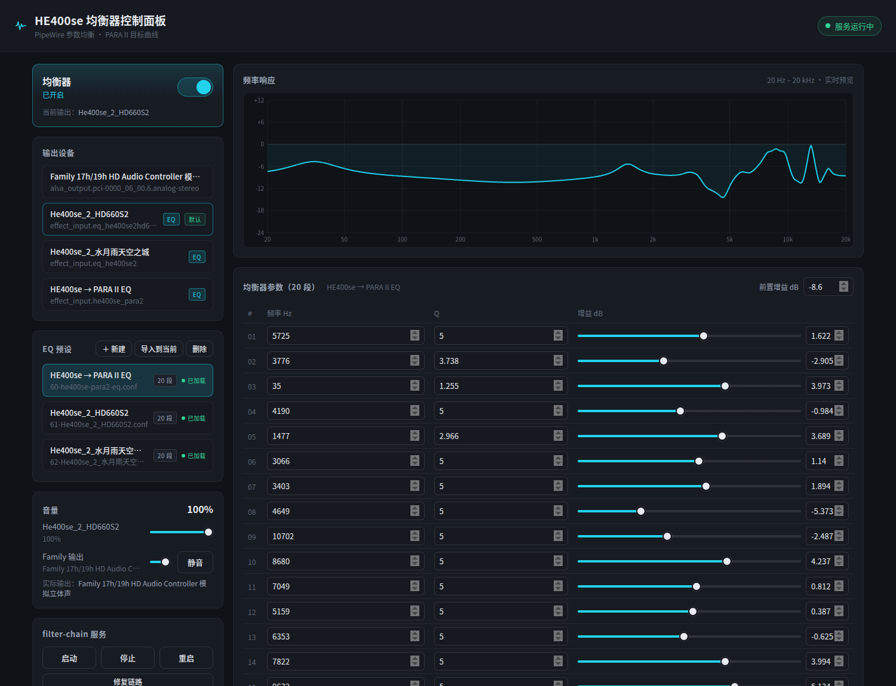

# eq-web — PipeWire 参数均衡器 Web 控制面板

一个本地 Web 控制面板，用于管理 PipeWire 耳机参数均衡器（PEQ）。为 HE400se → 水月雨 PARA II（20 段）的调音流程打造，也可适配任何耳机。



## 功能

- **EQ 总开关**：虚拟声卡 / 直通一键切换
- **双滑条音量**：EQ 条 × Family 物理输出条，按模式独立记忆，切换后各自恢复响度
- **多预设管理**：新建 / 导入 / 删除，每个预设对应一个独立虚拟声卡
- **文本解析器**：直接粘贴毁HiFi 导出的「类型=峰值 频率=… Gain=… Q=…」数据，自动生成 20 段 EQ 并自动计算防削波预增益
- **实时频率响应曲线**：直观查看当前 EQ 曲线
- **链路修复**：自动处理 WirePlumber 虚拟设备串联问题
- **零依赖**：后端 Python 标准库 + 原生 JS，无任何 CDN

## 关于毁HiFi

[毁HiFi](https://huihifi.com/home) 是一个专业耳机数据测评网站，提供在线调音/曲线工具。本项目的文本解析器直接兼容其个人调音页面导出的数据格式——在毁HiFi 上调好曲线后，把数据粘贴进本面板即可一键生成 EQ。推荐到 [huihifi.com](https://huihifi.com/home) 获取你耳机的 EQ 数据。

## 快速开始

**前置条件**：

- Ubuntu 24.04 + PipeWire + WirePlumber
- 已有一个 filter-chain EQ 预设（虚拟声卡）

**运行**：

```bash
git clone https://github.com/MAK1MA-AG0NY/eq-web.git
cd eq-web
./start.sh
```

浏览器打开 <http://127.0.0.1:8787> 即可。

**systemd 用户服务部署**（可选，开机自启）：

```bash
mkdir -p ~/.config/systemd/user
cp deploy/eq-web.service ~/.config/systemd/user/
systemctl --user daemon-reload
systemctl --user enable --now eq-web.service
```

桌面启动器：将 `deploy/eq-panel.desktop` 复制到 `~/.local/share/applications/`。

## 环境适配

本仓库是作者的个人环境版本，复用时需要修改：

| 位置 | 需要改的内容 |
|------|-------------|
| `server.py` | EQ conf 文件名、`EQ_NODE_NAME`、`EQ_DESCRIPTION`、`SERVICE_UNIT` 等常量 |
| `static/index.html` | 页面标题 |
| `deploy/eq-web.service` / `deploy/eq-panel.desktop` | `/home/mak1ma` 路径 |

## 文件结构

```
eq-web/
├── server.py              # 后端（Python 标准库 HTTP 服务）
├── start.sh               # 启动脚本
├── static/
│   ├── index.html         # 前端页面
│   ├── app.js             # 前端逻辑
│   └── style.css          # 样式
├── docs/
│   └── screenshot.png     # 界面截图
└── deploy/
    ├── eq-web.service     # systemd 用户服务
    └── eq-panel.desktop   # 桌面启动器
```

## 技术栈

PipeWire filter-chain（bq_peaking）· Python 3 标准库 · Web Audio API
